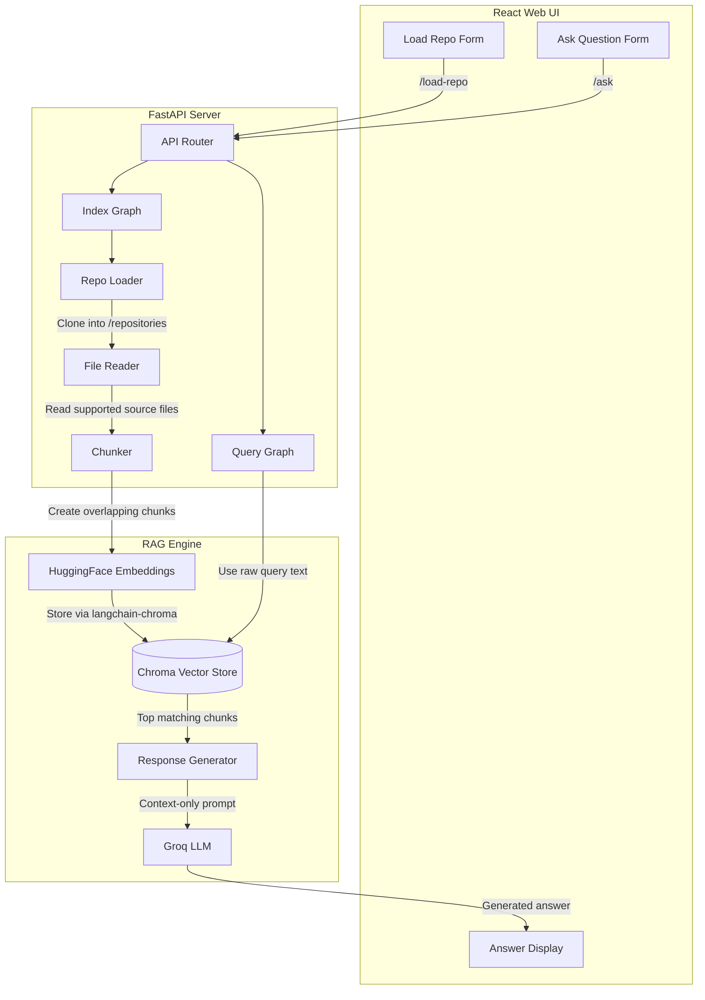

# RepoMind

Instantly index a public GitHub repository and chat with its codebase using a local retrieval pipeline plus Groq-hosted generation.

## Overview

RepoMind is a full-stack AI codebase assistant with:

- A `React + Vite` frontend for repository indexing and chat
- A `FastAPI` backend that exposes indexing and query endpoints
- A `LangGraph`-orchestrated backend pipeline for ingestion and retrieval
- Local embeddings and persistent Chroma storage for repository-specific search

The current production entrypoint for the web app is `backend.main:app`.

## Current Architecture

### Frontend

- `frontend/` contains the React application
- The UI lets users:
  - submit a public GitHub repository URL
  - index the repository
  - ask follow-up questions against the indexed repository

### Backend

- `backend/main.py` exposes the API
- `backend/services/graph/index_graph.py` defines the repository ingestion workflow
- `backend/services/graph/query_graph.py` defines the question-answer workflow
- `backend/services/` contains cloning, file reading, chunking, embedding, vector search, and LLM response generation

### Storage and AI stack

- Repository clones are stored in `repositories/`
- Chroma persists vector collections in `chroma_db/`
- Embeddings use `sentence-transformers/all-MiniLM-L6-v2`
- Generation uses Groq via `langchain-groq` with `llama-3.3-70b-versatile`

## System Architecture

Execution flow from the moment a repository URL is submitted to when RepoMind returns an answer:



## Backend Workflow

### Indexing flow

`POST /load-repo?repo_url=...`

1. Clone the target GitHub repository into `repositories/<repo_name>`
2. Read supported source files
3. Split file contents into overlapping chunks using `RecursiveCharacterTextSplitter`
4. Store chunk documents in a Chroma collection named after the repository

### Query flow

`GET /ask?query=...&repo_name=...`

1. Accept the raw user query
2. Retrieve the top matching chunks from the repository's Chroma collection
3. Build a context-only prompt
4. Send the prompt to Groq and return the generated answer

If no useful indexed context is found, the backend returns a safe fallback response instead of failing.

## API Endpoints

### `GET /`

Health check endpoint.

Example response:

```json
{
  "message": "RepoMind Running"
}
```

### `POST /load-repo`

Indexes a public GitHub repository.

Query parameters:

- `repo_url`: public HTTP/HTTPS GitHub repository URL

Example:

```text
POST /load-repo?repo_url=https://github.com/user/project
```

Response shape:

```json
{
  "status": "success",
  "repo_name": "project",
  "files_found": 42,
  "chunks_created": 188,
  "message": true
}
```

### `GET /ask`

Answers a question using the indexed repository context.

Query parameters:

- `query`: user question
- `repo_name`: repository collection name created during indexing

Example:

```text
GET /ask?query=How%20does%20auth%20work%3F&repo_name=project
```

Response shape:

```json
{
  "repo_name": "project",
  "query": "How does auth work?",
  "answer": "..."
}
```

## Supported File Types

The current file reader indexes:

- `.py`
- `.js`
- `.java`
- `.ts`
- `.cpp`
- `.h`
- `.cs`
- `.go`
- `.rs`

## Environment Variables

Create a root `.env` file with:

```env
GROQ_API_KEY=your_groq_api_key_here
```

Optional backend CORS override:

```env
CORS_ALLOW_ORIGINS=http://localhost:5173,http://127.0.0.1:5173
```

By default, the backend already allows common local frontend origins such as `localhost:5173` and `127.0.0.1:5173`.

## Local Setup

### Backend

```bash
python -m venv env
env\Scripts\activate
pip install -r requirements.txt
```

Run the API:

```bash
uvicorn backend.main:app --host 127.0.0.1 --port 8000 --reload --reload-dir backend
```

### Frontend

```bash
cd frontend
npm install
npm run dev
```

### Windows shortcut

You can also use:

```bash
start.bat
```

This starts:

- the FastAPI backend on `http://127.0.0.1:8000`
- the Vite frontend on `http://localhost:5173`

## Important Notes

- `app.py` in the project root is a legacy Streamlit prototype and is not the main frontend/backend path for the current web application.
- Chroma collections are keyed by repository name, so re-indexing the same repository name will target the same logical collection.
- The backend now includes explicit local CORS configuration and safer `/ask` error handling for frontend compatibility.

## Tech Stack

- Frontend: React 19, Vite
- Backend: FastAPI, Uvicorn
- Workflow orchestration: LangGraph
- LLM integration: LangChain, LangChain Groq
- Embeddings: LangChain HuggingFace, Sentence Transformers
- Vector store: Chroma, LangChain Chroma
- Git integration: GitPython
