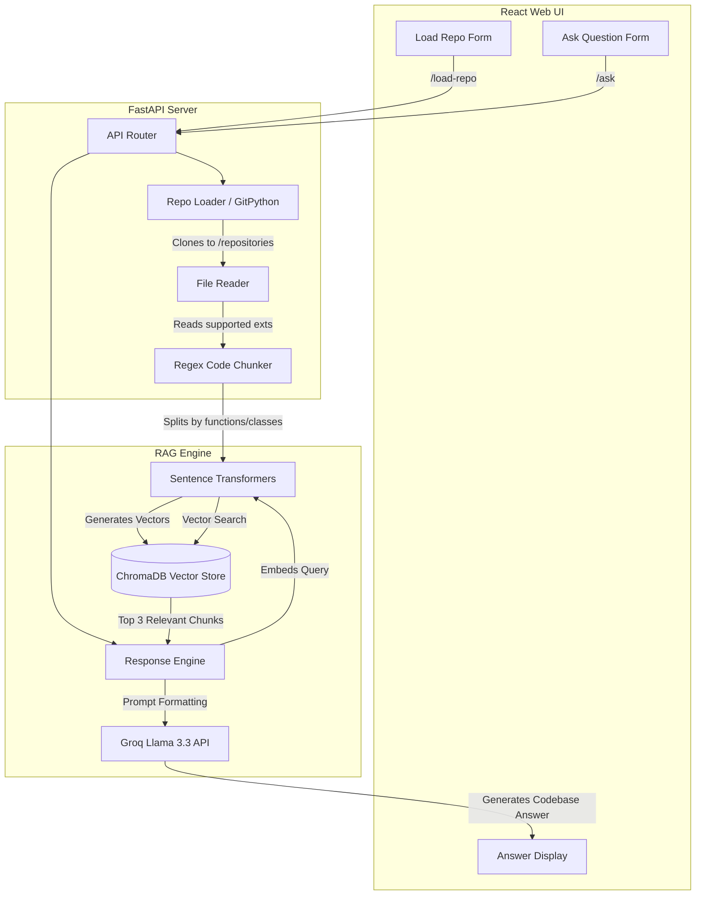

# ⚡ RepoMind
> **Instantly explore, analyze, and understand any GitHub repository using AI.**


RepoMind is an AI-powered developer tool that clones GitHub repositories, analyzes their source code, builds a local semantic search index, and allows you to chat with your codebase using natural language. Under the hood, it leverages a robust Retrieval-Augmented Generation (RAG) pipeline powered by Groq's high-speed inference and localized vector embeddings.

---

## 📑 Table of Contents
1. [Problem Statement](#-problem-statement)
2. [Features](#-features)
3. [Tech Stack](#-tech-stack)
4. [System Architecture](#-system-architecture)
5. [Getting Started](#-getting-started)
6. [API Endpoints](#-api-endpoints)
7. [Environment Variables](#-environment-variables)

---

## 🎯 Problem Statement
**The Problem:** Onboarding onto a new codebase, understanding unfamiliar architectures, or locating specific business logic in massive repositories is incredibly time-consuming. Developers spend hours reading code just to answer simple structural or functional questions. 

**The Solution:** RepoMind acts as a localized intelligent developer pair. By providing just a GitHub URL, the system automatically pulls the code, intelligently chunks it by function/class, generates high-dimension embeddings, and allows you to query the semantics of your codebase instantly.

---

## ✨ Features
✅ **Instant GitHub Processing** → Feed it any public GitHub URL and it automatically clones, reads, and analyzes the structure.  
✅ **Smart Code Chunking** → Context-aware regex splitting isolates functions, classes, and logic blocks across multiple languages (Python, JS, TS, Java, C++, etc.).  
✅ **Local Vector Search** → Uses `SentenceTransformers` and a persistent `ChromaDB` layer to search related code snippets entirely offline.  
✅ **Blazing Fast LLM Inference** → Generates codebase-grounded answers with Llama-3.3-70B via the lightning-fast Groq API.  
✅ **Modern Web UI** → Clean, glassmorphism-styled React/Vite interface for seamless repository interaction.  
✅ **Multi-Repo Support** → Isolates indexed vectors into separate collections dynamically grouped by repository names.  

---

## 🛠 Tech Stack

**Frontend**
* **Framework:** React 19 + Vite
* **Styling:** Custom CSS (Glassmorphism design)

**Backend**
* **Framework:** FastAPI
* **Server:** Uvicorn
* **Repo Manager:** GitPython 

**AI / ML Stack**
* **LLM:** Meta Llama 3.3 70B (Served via Groq API)
* **Embeddings:** `all-MiniLM-L6-v2` (via `sentence-transformers`)
* **Vector DB:** ChromaDB (Persistent SQLite Storage)

---

## 📐 System Architecture

Execution flow from the moment you submit a repository URL to when the AI returns an answer:



---

## 🚀 Getting Started

### Prerequisites
* Python 3.10+
* Node.js & npm
* A valid Groq API Key

### 1. Clone & Setup Backend
```bash
# Set up virtual environment
python -m venv env
env\Scripts\activate  # Windows
# source env/bin/activate # Mac/Linux

# Install dependencies
pip install -r requirements.txt
```

### 2. Configure Environment
Create a `.env` file in the root directory:
```env
GROQ_API_KEY=your_groq_api_key_here
```

### 3. Setup Frontend
```bash
cd frontend
npm install
```

### 4. Run the Application
You can use the designated startup script:
```bash
# On Windows
start.bat
```
*(Alternatively, run these manually in two separate terminal windows):*
* **Backend:** `uvicorn backend.main:app --reload --reload-dir backend`
* **Frontend:** `cd frontend && npm run dev`

---

## 🔌 API Endpoints

### Repository Endpoints
* `POST /load-repo?repo_url={url}`
  - Clones the target GitHub URL.
  - Automatically parses `.py, .js, .java, .ts, .cpp, .cs, .go, .rs` files.
  - Generates chunks, creates sentence embeddings, and stores them in ChromaDB.

### Search and Query
* `GET /ask?query={query}&repo_name={repo_name}`
  - Performs a semantic similarity search on your query inside ChromaDB.
  - Augments the Groq prompt with retrieved code snippets.
  - Returns grounded AI responses based highly strictly on the codebase.

### Core Testing Endpoints
* `GET /read-codebase`: Reads `sample_codebase/`.
* `GET /chunks`: Tests the chunking strategy.
* `GET /embeddings`: Generates ephemeral test embeddings.
* `GET /store-embeddings`: Pushes embeddings into a testing collection.

---

## ⚙️ How It Works Internally
1. **Repo Processing:** `GitPython` downloads the code into `/repositories/`.
2. **Chunking Pipeline:** To prevent AI context-limits, `chunker.py` uses Regex to intelligently slice files by native declarations like `def`, `class`, or `const () =>`.
3. **Embeddings:** Text chunks run through `SentenceTransformers` (`all-MiniLM-L6-v2`) forming mathematical vectors mapping the semantic meaning of the code block.
4. **LLM Generation:** When a user asks a question, the vector database finds the closest 3 code blocks matching the question. These blocks are patched into a System Prompt and passed to Groq processing.